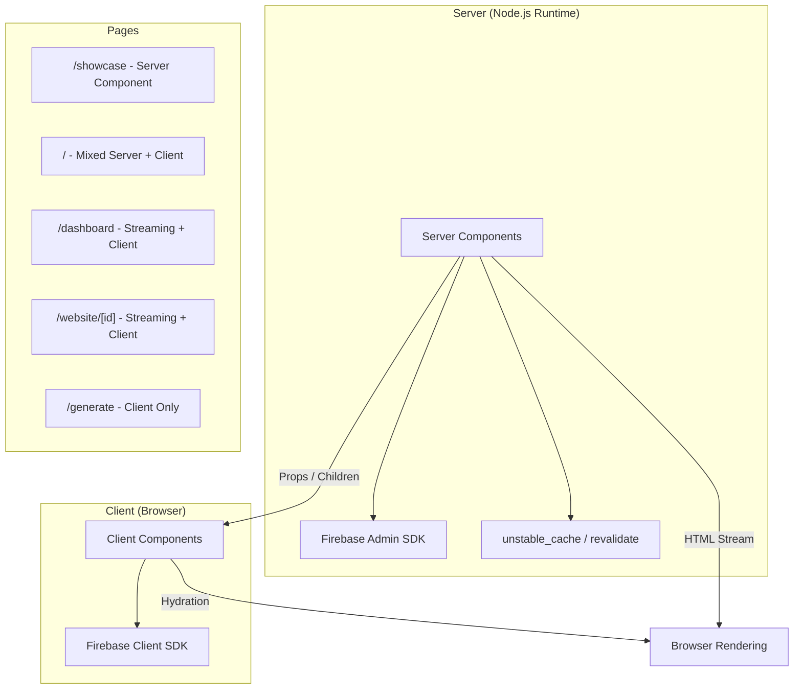
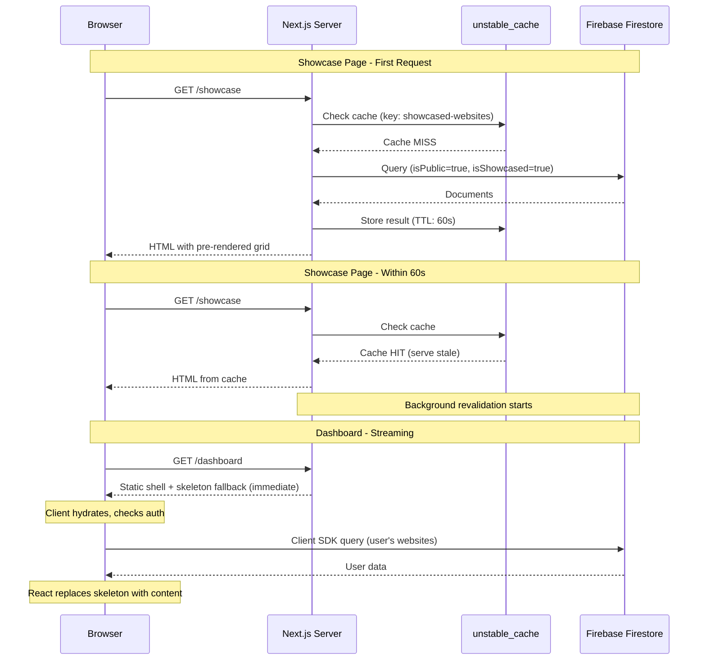

# Design Document: Server-Side Rendering Migration

## Overview

This design describes the migration of the AI Website Generator application from client-side rendering (CSR) to server-side rendering (SSR) using Next.js 16 App Router server components. The migration targets pages where SSR provides meaningful performance and UX benefits: the Showcase Page (`/showcase`), the Login Page (`/`), and auth-protected pages (Dashboard, Website Preview) with streaming via Suspense.

The `/view/[id]` page already uses SSR and serves as a reference implementation. The Generate Page (`/generate`) remains fully client-rendered due to its interactive nature.

### Key Design Decisions

1. **No `cacheComponents` flag** — The project does not use the new Cache Components model (`use cache` directive). Instead, we use the previous caching model with `unstable_cache`, route segment config (`revalidate`), and `fetch` options per the Next.js 16 docs for projects without `cacheComponents: true`.

2. **Firebase Admin SDK for server-side data access** — Server components cannot use the client-side Firebase SDK (which relies on browser APIs). We use `firebase-admin` (already configured in `src/lib/firebaseAdmin.ts`) for server-side Firestore reads.

3. **Incremental migration with composition** — Each page is migrated independently. Interactive parts are extracted into `'use client'` components composed within server-rendered page layouts. This follows the interleaving pattern documented in Next.js 16.

4. **Streaming for auth-protected pages** — Dashboard and Website Preview pages use `<Suspense>` boundaries to stream content. The static shell (header, navigation, layout) renders immediately; personalized data streams in asynchronously.

## Architecture



### Rendering Strategy Per Page

| Page | Rendering Model | Caching | Data Source (Server) |
|------|----------------|---------|---------------------|
| `/showcase` | SSR with revalidation | `revalidate = 60` | Firebase Admin SDK |
| `/` (Login) | Mixed: SSR static + Client auth | `revalidate = 60` (showcase section) | Firebase Admin SDK |
| `/dashboard` | Streaming via Suspense | No cache (per-user data) | Client-side Firebase |
| `/website/[id]` | Streaming via Suspense | No cache (per-user data) | Client-side Firebase |
| `/generate` | Full CSR (`'use client'`) | N/A | N/A |

## Components and Interfaces

### New Server-Side Data Layer

```typescript
// src/lib/serverData.ts
// Server-only data fetching using Firebase Admin SDK

import { getFirestore } from 'firebase-admin/firestore';
import { unstable_cache } from 'next/cache';

export interface ShowcasedWebsiteServer {
  id: string;
  title: string;
  thumbnailUrl: string;
  creatorName: string;
  showcasedAt: string;
}

export interface PaginatedShowcaseResult {
  items: ShowcasedWebsiteServer[];
  totalCount: number;
  page: number;
  pageSize: number;
  totalPages: number;
}

/**
 * Fetches showcased websites from Firestore using Admin SDK.
 * Cached with unstable_cache for 60-second revalidation.
 */
export const getShowcasedWebsitesServer = unstable_cache(
  async (page: number, pageSize: number): Promise<PaginatedShowcaseResult> => {
    // Implementation uses firebase-admin Firestore
  },
  ['showcased-websites'],
  { revalidate: 60, tags: ['showcase'] }
);

/**
 * Fetches showcase preview (up to 6 items) for Login page.
 * Same cache tag as full showcase for consistent revalidation.
 */
export const getShowcasePreviewServer = unstable_cache(
  async (): Promise<ShowcasedWebsiteServer[]> => {
    // Fetches up to 6 showcased websites sorted by showcasedAt desc
  },
  ['showcase-preview'],
  { revalidate: 60, tags: ['showcase'] }
);
```

### Showcase Page Component Hierarchy

```
/showcase/page.tsx (Server Component - async)
├── <header> (static HTML)
├── <ShowcaseGrid> (Server Component - renders initial data)
│   └── <ShowcaseWebsiteCard> (existing component, rendered server-side)
├── <ShowcasePagination> (Client Component - 'use client')
│   └── Handles page changes, fetches subsequent pages client-side
└── <AppFooter> (Server Component)
```

### Login Page Component Hierarchy

```
/page.tsx (Server Component - async)
├── <HeroSection> (Server Component - static HTML)
│   ├── Logo, title, description
│   └── <AuthCard> (Client Component - 'use client')
│       ├── <GoogleSignInButton>
│       ├── Auth state management
│       └── Error display & redirect logic
├── <FeaturesGrid> (Server Component - static HTML)
├── <ShowcasePreviewServer> (Server Component - fetches data)
│   └── <ShowcaseCard> (presentational, rendered server-side)
└── <AppFooter> (Server Component)
```

### Dashboard Page Component Hierarchy

```
/dashboard/page.tsx (Server Component)
├── <AppHeader> (rendered in static shell)
├── <Suspense fallback={<DashboardSkeleton />}>
│   └── <DashboardContent> (Client Component - 'use client')
│       ├── Auth check + data fetching via useWebsites hook
│       ├── <WebsiteCard> grid
│       ├── <Pagination>
│       └── <DeleteConfirmDialog>
└── <AppFooter>
```

### Website Preview Page Component Hierarchy

```
/website/[id]/page.tsx (Server Component)
├── Layout shell + toolbar (static HTML)
├── <Suspense fallback={<PreviewSkeleton />}>
│   └── <WebsitePreviewContent> (Client Component - 'use client')
│       ├── Auth check + data fetching
│       ├── <CodeEditor>
│       ├── <PreviewRenderer>
│       └── Auto-save logic
└── Footer
```

### Key Interfaces

```typescript
// Props for the showcase pagination client component
interface ShowcasePaginationProps {
  initialPage: number;
  initialTotalPages: number;
  initialTotalCount: number;
  pageSize: number;
}

// Props for the auth card client component on Login page
interface AuthCardProps {
  // No props needed - manages its own auth state
}

// Props for the dashboard content client component
interface DashboardContentProps {
  // No props - uses useAuth() and useWebsites() hooks internally
}

// Error boundary component for server-rendered sections
interface ServerErrorFallbackProps {
  message: string;
  retryHref: string;
}
```

## Data Models

### Server-Side Data Flow



### Cache Strategy

| Data | Cache Key | TTL | Tags | Staleness Limit |
|------|-----------|-----|------|----------------|
| Showcase page 1 | `['showcased-websites', 1, 12]` | 60s | `['showcase']` | 24 hours |
| Showcase page N | `['showcased-websites', N, 12]` | 60s | `['showcase']` | 24 hours |
| Login preview | `['showcase-preview']` | 60s | `['showcase']` | 24 hours |
| Dashboard data | No server cache | N/A | N/A | N/A (client-fetched) |
| Website Preview data | No server cache | N/A | N/A | N/A (client-fetched) |

### Metadata Generation

```typescript
// /showcase/page.tsx
import { Metadata } from 'next';

export const metadata: Metadata = {
  title: 'Community Showcase | AI Website Generator',
  description: 'Discover amazing websites created by our community using AI. Get inspired and create your own AI-generated website.',
};
```

## Correctness Properties

*A property is a characteristic or behavior that should hold true across all valid executions of a system — essentially, a formal statement about what the system should do. Properties serve as the bridge between human-readable specifications and machine-verifiable correctness guarantees.*

### Property 1: Showcase query returns only valid public showcased items in correct order

*For any* collection of website documents with arbitrary combinations of `isPublic` and `isShowcased` flags, and *for any* valid `pageSize` (1–100), the server showcase query function SHALL return only documents where both `isPublic === true` AND `isShowcased === true`, sorted by `showcasedAt` in descending order, with the result set containing at most `pageSize` items.

**Validates: Requirements 1.2, 2.3**

### Property 2: Cache staleness policy correctly enforces 24-hour boundary

*For any* cache entry with a given age in seconds and *for any* revalidation outcome (success or failure), the staleness policy function SHALL serve cached content when age is less than 86400 seconds (24 hours) and revalidation has failed, and SHALL attempt a fresh server render when the cache age equals or exceeds 86400 seconds regardless of previous cached content availability.

**Validates: Requirements 6.4**

## Error Handling

### Server-Side Error Handling

| Scenario | Behavior | User Impact |
|----------|----------|-------------|
| Showcase fetch fails on initial render | Render error message + retry button | User sees error state, can reload |
| Login page showcase preview fetch fails | Render empty state section | Page still loads; auth section unaffected |
| Dashboard Suspense boundary error | `error.tsx` catches; shows error + retry | User sees error in content area only |
| Website Preview Suspense boundary error | `error.tsx` catches; shows error + retry | User sees error in content area only |
| Cache revalidation fails (< 24h stale) | Serve stale content transparently | User sees slightly outdated data |
| Cache stale > 24h AND fresh render fails | Display "temporarily unavailable" message | User cannot access showcase |

### Error Boundaries

Each page directory gets an `error.tsx` file to catch runtime errors within the streaming Suspense boundary:

```typescript
// src/app/showcase/error.tsx
'use client';

export default function ShowcaseError({
  error,
  reset,
}: {
  error: Error & { digest?: string };
  reset: () => void;
}) {
  return (
    <div className="flex flex-col items-center justify-center py-16">
      <p className="text-destructive mb-4">
        Something went wrong loading the showcase.
      </p>
      <button onClick={() => reset()}>Try Again</button>
    </div>
  );
}
```

### Graceful Degradation

- **Showcase page**: If the server-side fetch fails completely, the error boundary renders a retry UI. The page structure (header, footer) still renders.
- **Login page**: If the showcase preview section fails, only that section shows an empty state. The auth card and hero render independently.
- **Dashboard/Website Preview**: The static shell always renders. Only the data-dependent content section can fail, contained within its Suspense boundary.

## Testing Strategy

### Testing Approach

This feature uses a **dual testing approach**:

1. **Property-based tests** (using `fast-check`) for universal properties about data correctness
2. **Example-based unit tests** (using `vitest` + `@testing-library/react`) for specific UI behaviors, edge cases, and integration checks

### Property-Based Tests

Property tests use the existing `fast-check` library (already in devDependencies) with `vitest`.

**Configuration:**
- Minimum 100 iterations per property test
- Test timeout: 30 seconds (already configured in `vitest.config.ts`)
- Each test tagged with a comment referencing its design property

**Tag format:** `Feature: server-side-rendering-migration, Property {number}: {property_text}`

**Property 1 implementation**: Generate arbitrary arrays of website objects with random `isPublic`, `isShowcased`, `showcasedAt` values. Pass them through the server query filtering/sorting logic. Assert the result contains only qualifying items, in descending `showcasedAt` order, with count ≤ pageSize.

**Property 2 implementation**: Generate random `cacheAge` (0–172800 seconds) and `revalidationSuccess` (boolean). Apply the staleness policy function. Assert that when cacheAge < 86400 and revalidation failed, the decision is "serve stale". When cacheAge ≥ 86400, the decision is "attempt fresh render".

### Unit Tests (Example-Based)

| Test Area | What to Test | Type |
|-----------|-------------|------|
| Showcase page metadata | Static metadata export contains title and description | Smoke |
| Showcase server component | Renders website grid with provided data | Unit |
| Showcase error state | Renders error message + retry button on fetch failure | Edge case |
| Showcase pagination client | Calls fetchPage, triggers scrollTo on page change | Unit |
| Showcase skeleton | Renders skeleton cards during loading | Unit |
| Login page server sections | Hero, features grid, footer render without JS | Integration |
| Login AuthCard | Sign-in button, error display/dismiss, redirect | Unit |
| Login showcase preview | Renders up to 6 items; shows empty state on failure | Unit + Edge |
| Dashboard shell | Header + nav render in static shell | Integration |
| Dashboard skeleton | Loading skeleton renders as Suspense fallback | Unit |
| Dashboard feature parity | Delete, navigate, edit, beautify, showcase toggle | Unit |
| Website Preview shell | Layout + toolbar in static shell | Integration |
| Website Preview skeleton | Loading skeleton for editor + preview panels | Unit |
| Website Preview features | Code edit, preview, beautify, download, auto-save | Unit |
| Generate page | Retains `'use client'` directive; no SSR | Smoke |
| Cache configuration | unstable_cache uses revalidate: 60 | Smoke |
| Stale cache > 24h + failure | Error message renders | Edge case |

### Test File Structure

```
src/
├── lib/
│   ├── serverData.test.ts          # Property tests for showcase query logic
│   └── cachePolicy.test.ts         # Property tests for cache staleness logic
├── app/
│   ├── showcase/
│   │   ├── page.test.tsx           # Unit tests for showcase server component
│   │   └── ShowcasePagination.test.tsx
│   ├── page.test.tsx               # Updated login page tests
│   ├── dashboard/
│   │   └── page.test.tsx           # Updated dashboard tests
│   └── website/[id]/
│       └── page.test.tsx           # Updated website preview tests
```

### What is NOT tested with PBT

- Streaming behavior (infrastructure concern, tested via integration)
- Core Web Vitals metrics (measured with Lighthouse/browser tools)
- Hydration correctness (React's responsibility, validated by absence of warnings)
- Visual layout stability (CLS measurement, not a code property)
- Bundle size reduction (build-time measurement)
