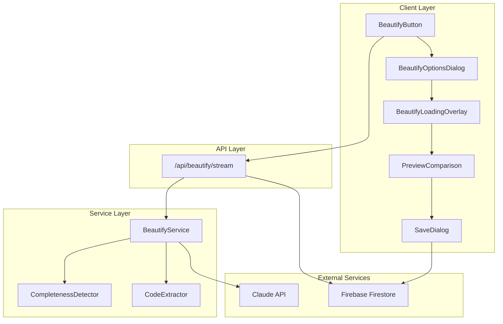
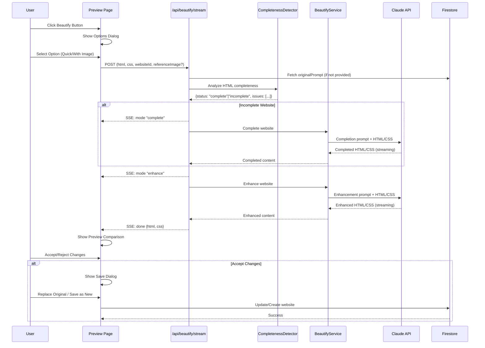
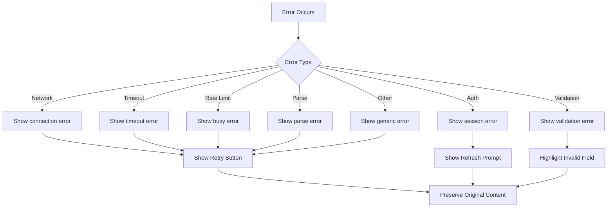

# Design Document: Website Beautify Feature

## Overview

The Website Beautify feature enables users to enhance their generated websites with a single click. The system intelligently detects whether a website is complete or incomplete, taking appropriate action: incomplete websites are first completed before beautification, while complete websites receive visual enhancements directly.

The feature integrates with the existing website generation infrastructure, leveraging the Claude API for AI-powered improvements. It provides real-time streaming feedback during the beautification process and offers comprehensive before/after comparison for user review.

### Key Capabilities

1. **Intelligent Completeness Detection**: Analyzes HTML/CSS to determine if a website needs completion or just enhancement
2. **Two-Phase Processing**: Completes incomplete websites before applying visual enhancements
3. **Reference Image Support**: Optional image upload to guide beautification style
4. **Real-Time Streaming**: SSE-based streaming with progress indicators
5. **Before/After Comparison**: Side-by-side preview with synchronized scrolling
6. **Version Management**: Option to replace original or save as new website

## Architecture

The feature follows the existing Next.js App Router architecture with a clear separation between client components, API routes, and services.



### Data Flow



## Components and Interfaces

### API Route: `/api/beautify/stream`

**Location**: `src/app/api/beautify/stream/route.ts`

The streaming API endpoint for website beautification, following the same pattern as the existing `/api/generate/stream` route.

```typescript
/**
 * Request body interface for beautification
 */
interface BeautifyStreamRequest {
  /** Firestore document ID of the website */
  websiteId: string;
  /** Current HTML content */
  html: string;
  /** Current CSS content */
  css: string;
  /** Original text prompt (optional, fetched from DB if not provided) */
  originalPrompt?: string;
  /** Base64-encoded reference image (optional) */
  referenceImage?: string;
  /** MIME type of reference image */
  referenceImageMimeType?: 'image/png' | 'image/jpeg' | 'image/webp';
}

/**
 * SSE event types emitted by the API
 */
type BeautifyEventType = 'start' | 'mode' | 'text' | 'done' | 'error';

interface BeautifyStreamEvent {
  type: BeautifyEventType;
  content?: string;
  mode?: 'complete' | 'enhance';
  issues?: string[];
  result?: {
    html: string;
    css: string;
  };
  error?: string;
}

/**
 * Route configuration
 */
export const maxDuration = 120; // 120 seconds max
```

### Service: CompletenessDetector

**Location**: `src/services/beautify/completenessDetector.ts`

Analyzes HTML/CSS to determine if a website is structurally complete.

```typescript
/**
 * Result of completeness detection
 */
interface CompletenessResult {
  /** Whether the website is complete */
  isComplete: boolean;
  /** Classification for display */
  status: 'complete' | 'incomplete';
  /** List of detected issues (empty if complete) */
  issues: string[];
  /** Whether the generation marker was found */
  hasGenerationMarker: boolean;
  /** Missing structural elements */
  missingElements: ('header' | 'main' | 'footer')[];
  /** Truncation issues detected */
  truncationIssues: string[];
}

/**
 * Detects website completeness
 * @param html - HTML content to analyze
 * @param css - CSS content to analyze
 * @returns CompletenessResult with classification and issues
 */
function detectCompleteness(html: string, css: string): CompletenessResult;

/**
 * Generation marker constant
 */
const GENERATION_MARKER = '<!-- GENERATION_COMPLETE -->';
```

### Service: BeautifyService

**Location**: `src/services/beautify/beautifyService.ts`

Handles the beautification logic including completion and enhancement.

```typescript
/**
 * Beautification mode
 */
type BeautificationMode = 'complete' | 'enhance';

/**
 * Options for beautification
 */
interface BeautifyOptions {
  html: string;
  css: string;
  originalPrompt?: string | null;
  referenceImage?: string;
  referenceImageMimeType?: string;
  completenessResult: CompletenessResult;
}

/**
 * Stream event for beautification
 */
interface BeautifyStreamEvent {
  type: 'start' | 'mode' | 'text' | 'done' | 'error';
  content?: string;
  mode?: BeautificationMode;
  issues?: string[];
  result?: { html: string; css: string };
  error?: string;
}

/**
 * Beautifies a website with streaming output
 * @param options - Beautification options
 * @param signal - Optional AbortSignal for cancellation
 * @returns AsyncGenerator of stream events
 */
async function* beautifyWebsiteStream(
  options: BeautifyOptions,
  signal?: AbortSignal
): AsyncGenerator<BeautifyStreamEvent>;
```

### Component: BeautifyButton

**Location**: `src/components/beautify/BeautifyButton.tsx`

Reusable button component for triggering beautification.

```typescript
interface BeautifyButtonProps {
  /** Whether beautification is in progress */
  isLoading?: boolean;
  /** Whether the button is disabled */
  disabled?: boolean;
  /** Click handler */
  onClick: () => void;
  /** Button variant for different contexts */
  variant?: 'primary' | 'secondary' | 'icon-only';
  /** Additional CSS classes */
  className?: string;
}
```

### Component: BeautifyOptionsDialog

**Location**: `src/components/beautify/BeautifyOptionsDialog.tsx`

Modal dialog for selecting beautification options.

```typescript
interface BeautifyOptionsDialogProps {
  /** Whether the dialog is open */
  isOpen: boolean;
  /** Close handler */
  onClose: () => void;
  /** Handler when user confirms beautification */
  onConfirm: (options: BeautifyDialogResult) => void;
}

interface BeautifyDialogResult {
  /** Whether to use a reference image */
  useReferenceImage: boolean;
  /** Base64 encoded image data (if using reference) */
  referenceImage?: string;
  /** MIME type of the reference image */
  referenceImageMimeType?: string;
}
```

### Component: BeautifyLoadingOverlay

**Location**: `src/components/beautify/BeautifyLoadingOverlay.tsx`

Overlay showing beautification progress with streaming preview.

```typescript
interface BeautifyLoadingOverlayProps {
  /** Current beautification mode */
  mode: 'analyzing' | 'completing' | 'enhancing' | 'finalizing';
  /** Raw streaming content for preview */
  streamingContent: string;
  /** Elapsed time in seconds */
  elapsedTime: number;
  /** Whether the preview is expanded */
  isPreviewExpanded: boolean;
  /** Toggle preview expansion */
  onTogglePreview: () => void;
  /** Cancel handler */
  onCancel: () => void;
}
```

### Component: PreviewComparison

**Location**: `src/components/beautify/PreviewComparison.tsx`

Side-by-side comparison of original and beautified versions.

```typescript
interface PreviewComparisonProps {
  /** Original HTML content */
  originalHtml: string;
  /** Original CSS content */
  originalCss: string;
  /** Beautified HTML content */
  beautifiedHtml: string;
  /** Beautified CSS content */
  beautifiedCss: string;
  /** Handler when user accepts changes */
  onAccept: () => void;
  /** Handler when user rejects changes */
  onReject: () => void;
}

type ComparisonMode = 'side-by-side' | 'overlay';
```

### Component: SaveOptionsDialog

**Location**: `src/components/beautify/SaveOptionsDialog.tsx`

Dialog for choosing how to save beautified content.

```typescript
interface SaveOptionsDialogProps {
  /** Whether the dialog is open */
  isOpen: boolean;
  /** Original website title */
  originalTitle: string;
  /** Close handler */
  onClose: () => void;
  /** Handler when user chooses to replace original */
  onReplaceOriginal: () => Promise<void>;
  /** Handler when user chooses to save as new */
  onSaveAsNew: () => Promise<void>;
}
```

## Data Models

### Extended GeneratedWebsite Type

The existing `GeneratedWebsite` interface needs to be extended with the `originalPrompt` field:

```typescript
/**
 * Extended website interface with original prompt
 * Location: src/types/website.ts
 */
export interface GeneratedWebsite {
  // ... existing fields ...

  /** Original text prompt used for generation (null for screenshot-based) */
  originalPrompt: string | null;
}
```

### Firestore Schema Update

The `websites` collection documents will include:

```typescript
{
  // ... existing fields ...
  originalPrompt: string | null,  // Max 10,000 characters
}
```

### Beautification Prompts

**Location**: `src/lib/beautifyPrompts.ts`

```typescript
/**
 * Prompt for completing incomplete websites
 */
export const COMPLETION_PROMPT = `You are a website completion assistant...`;

/**
 * Prompt for enhancing complete websites
 */
export const ENHANCEMENT_PROMPT = `You are a website enhancement assistant...`;
```

## Correctness Properties

*A property is a characteristic or behavior that should hold true across all valid executions of a system—essentially, a formal statement about what the system should do. Properties serve as the bridge between human-readable specifications and machine-verifiable correctness guarantees.*

### Property 1: Original Prompt Storage Round-Trip

*For any* valid text prompt used to generate a website, storing and then retrieving the website SHALL return the same original prompt value.

**Validates: Requirements 0.1, 0.4**

### Property 2: Original Prompt Length Validation

*For any* string with length greater than 10,000 characters, the system SHALL reject it as an invalid originalPrompt.

**Validates: Requirements 0.2**

### Property 3: Screenshot Generation Excludes Original Prompt

*For any* website generated from a screenshot, the `originalPrompt` field SHALL be null or undefined.

**Validates: Requirements 0.3**

### Property 4: Generation Marker Implies Complete Classification

*For any* HTML content containing the `<!-- GENERATION_COMPLETE -->` marker, the Completeness_Detector SHALL classify it as "complete".

**Validates: Requirements 1.2, 1.3**

### Property 5: Missing Structural Elements Implies Incomplete

*For any* HTML content without the generation marker that is missing header, main, or footer elements, the Completeness_Detector SHALL classify it as "incomplete".

**Validates: Requirements 1.5, 1.6**

### Property 6: Truncation Detection Implies Incomplete

*For any* HTML content without the generation marker that contains unclosed tags or truncated text, the Completeness_Detector SHALL classify it as "incomplete".

**Validates: Requirements 1.7, 1.8**

### Property 7: Completeness Detection Returns Classification and Issues

*For any* HTML/CSS input, the Completeness_Detector SHALL return both a classification ("complete" or "incomplete") and a list of detected issues.

**Validates: Requirements 1.9**

### Property 8: Completed Websites Contain Generation Marker

*For any* website that undergoes completion, the resulting HTML SHALL contain the generation marker `<!-- GENERATION_COMPLETE -->`.

**Validates: Requirements 2.8**

### Property 9: Authentication Required for API Access

*For any* request to `/api/beautify/stream` without a valid Firebase authentication token, the API SHALL return a 401 status.

**Validates: Requirements 4.2, 4.3**

### Property 10: Required Fields Validation

*For any* request to `/api/beautify/stream` missing websiteId, html, or css fields, the API SHALL return a 400 status with a validation error.

**Validates: Requirements 4.4, 4.5**

### Property 11: Reference Image MIME Type Validation

*For any* request with a referenceImage that has a MIME type other than image/png, image/jpeg, or image/webp, the API SHALL return a 400 status.

**Validates: Requirements 4.7, 4.8**

### Property 12: SSE Response Format

*For any* valid authenticated request to `/api/beautify/stream`, the API SHALL return a response with Content-Type `text/event-stream`.

**Validates: Requirements 4.9**

### Property 13: Image Upload Size Validation

*For any* reference image exceeding 10MB in size, the upload validation SHALL reject the image.

**Validates: Requirements 0.1.6**

### Property 14: Image Format Acceptance

*For any* image file with MIME type image/png, image/jpeg, or image/webp, the upload validation SHALL accept the file.

**Validates: Requirements 0.1.5**

### Property 15: Synchronized Scroll Behavior

*For any* scroll action on one preview iframe in the comparison view, the other iframe SHALL scroll to the same position.

**Validates: Requirements 7.3**

### Property 16: Viewport Mode Applies to Both Previews

*For any* viewport mode change (desktop, tablet, mobile) in the comparison view, both preview iframes SHALL update to the new viewport size.

**Validates: Requirements 7.4**

### Property 17: Save as New Title Transformation

*For any* website title when "Save as New" is selected, the new website's title SHALL be the original title with " (Beautified)" appended.

**Validates: Requirements 8.5**

### Property 18: Cancellation Preserves Original Content

*For any* beautification operation that is cancelled, the original HTML and CSS content SHALL remain unchanged.

**Validates: Requirements 9.6**

### Property 19: Error Type to Message Mapping

*For any* network error from the Beautify_API, the UI SHALL display "Unable to connect. Please check your internet connection." *For any* timeout error, the UI SHALL display the timeout-specific message. *For any* authentication error, the UI SHALL display "Session expired. Please refresh the page and try again."

**Validates: Requirements 10.1, 10.2, 10.3**

### Property 20: User Edits Preserved on Error

*For any* beautification failure, all user edits made before initiating beautification SHALL be preserved.

**Validates: Requirements 10.8**

## Error Handling

### Error Categories and User Messages

| Error Type | HTTP Status | User Message | Recovery Action |
|------------|-------------|--------------|-----------------|
| Network Error | - | "Unable to connect. Please check your internet connection." | Retry button |
| Timeout | 408 or timeout | "Beautification timed out. The website may be too complex. Please try again." | Retry button |
| Authentication | 401 | "Session expired. Please refresh the page and try again." | Refresh page |
| Rate Limit | 429 | "Service is busy. Please wait a moment and try again." | Retry after delay |
| Validation | 400 | Field-specific message | Fix input |
| Parse Error | - | "Failed to process beautified content. Please try again." | Retry button |
| Server Error | 500 | "Something went wrong. Please try again." | Retry button |

### Error Handling Flow



### Cancellation Handling

- User can cancel at any stage via the cancel button
- AbortController propagates cancellation to Claude API request
- Original content is always preserved on cancellation
- UI returns to normal preview mode within 5 seconds of cancel click

## Testing Strategy

### Unit Tests

Unit tests focus on isolated component and function behavior:

1. **CompletenessDetector**
   - Generation marker detection
   - Structural element detection (header, main, footer)
   - Truncation indicator detection
   - Combined classification logic

2. **BeautifyService**
   - Prompt construction with/without originalPrompt
   - Prompt construction with/without referenceImage
   - Code extraction from response
   - Mode selection based on completeness

3. **UI Components**
   - BeautifyButton rendering and states
   - BeautifyOptionsDialog option selection
   - Image upload validation
   - PreviewComparison scroll synchronization
   - SaveOptionsDialog title transformation

### Property-Based Tests

Property-based tests verify universal properties across generated inputs:

**Test Configuration**: Minimum 100 iterations per property test using `fast-check` library.

1. **Original Prompt Storage**
   - Generate random prompts up to 10,000 characters
   - Verify round-trip storage/retrieval preserves content

2. **Completeness Detection**
   - Generate HTML with various combinations of elements
   - Verify marker presence → complete classification
   - Verify missing elements → incomplete classification

3. **API Validation**
   - Generate requests with various field combinations
   - Verify authentication enforcement
   - Verify required field validation

4. **Error Message Mapping**
   - Generate various error types
   - Verify correct user-facing messages

### Integration Tests

Integration tests verify component interactions:

1. **API Route Tests**
   - Authentication flow with mocked Firebase Admin
   - SSE streaming with mocked Claude API
   - Error handling for various failure modes

2. **End-to-End Flow Tests**
   - Complete beautification flow from button click to save
   - Cancellation at various stages
   - Error recovery scenarios

### Test Tagging Convention

All property-based tests should be tagged with the corresponding design property:

```typescript
// Feature: website-beautify, Property 4: Generation marker implies complete classification
it.prop([fc.string()], { numRuns: 100 })('generation marker implies complete', (html) => {
  // Test implementation
});
```
